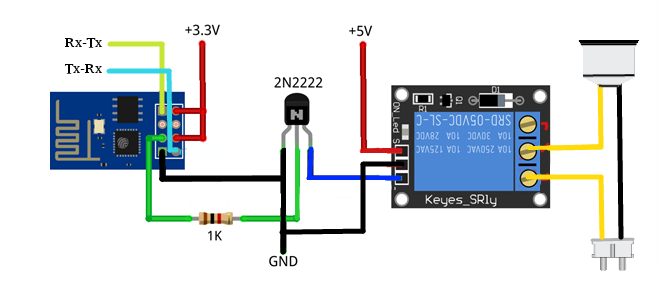
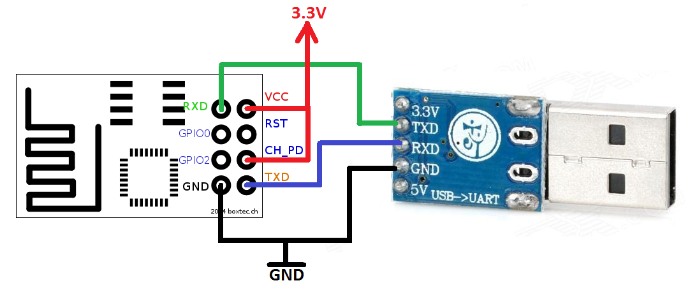

Connection diagram ESP-01 to Relay: 

Arduino allows installation of third-party platform packages using Boards Manager. We have packages available for Windows, Mac OS, and Linux (32 and 64 bit).

1. Install Arduino 1.6.8 from: https://www.arduino.cc/en/main/software
2. Start Arduino and open Preferences window.
3. Enter http://arduino.esp8266.com/stable/package_esp8266com_index.json into Additional Board Manager URLs field.
4. Open Boards Manager from Tools > Board menu and install esp8266 platform (and don't forget to select your ESP8266 board from Tools > Board menu after installation).

---------------------------------------------------------------------

COMPILING and UPLOADING:

Before you start uploading make sure you connect GND to GPIO0. After you set proper WiFi name and password compile and upload program. When you finish with program upload remove GND wire from GPIO0 pin to enter in program execution mode.
Restart our module and keep USB to TTL connected to Module. In Tools->Serial Monitor check if ESP module connects to WiFi. If connection is successful 
you will also see IP address of ESP8266

---------------------------------------------------------------------

ESP-01 diagram and connection usb-ttl converter:

---------------------------------------------------------------------
https://github.com/esp8266/Arduino/

